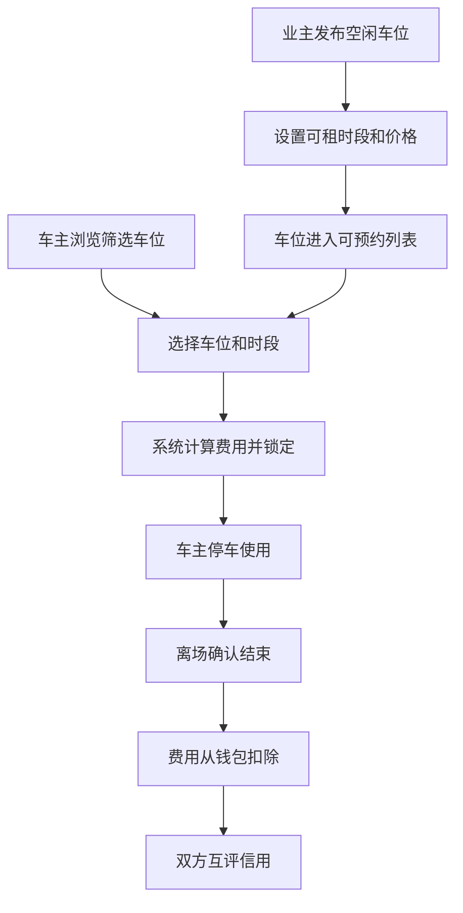

## 1. 产品概述
小区车位共享撮合平台，解决白天车位空闲、晚上车位紧张的资源浪费问题。有车位的业主可发布空闲时段出租，需要停车的邻居可按时间段预约，系统自动匹配并计算费用，实现车位资源高效利用。

- 目标用户：小区业主（车位出租方）、小区车主（车位承租方）
- 核心价值：盘活闲置车位资源，降低业主停车成本，缓解小区停车难

## 2. 核心功能

### 2.1 用户角色
| 角色 | 注册方式 | 核心权限 |
|------|----------|----------|
| 业主 | 模拟登录 | 发布空闲车位、管理车位、查看收益、评价租客 |
| 车主 | 模拟登录 | 浏览车位、预约车位、管理钱包、离场确认、评价业主 |

### 2.2 功能模块
1. **首页/车位列表**：车位概览、筛选条件、车位卡片列表
2. **车位发布**：业主选择可租时段、设置价格、发布车位
3. **车位预约**：车主筛选车位、选择时间段、锁定预约
4. **我的钱包**：余额查看、充值、消费记录
5. **订单管理**：预约记录、使用中订单、历史订单
6. **信用评价**：订单完成后双方互评、信用分展示
7. **我的车位**：业主管理已发布的车位

### 2.3 页面详情
| 页面名称 | 模块名称 | 功能描述 |
|-----------|-------------|---------------------|
| 首页 | 顶部导航 | 角色切换、钱包入口、用户信息 |
| 首页 | 统计卡片 | 今日空闲车位、进行中订单、钱包余额 |
| 首页 | 筛选栏 | 日期选择、时段选择、价格区间筛选 |
| 首页 | 车位列表 | 车位卡片展示，包含位置、价格、可用时段、信用评分 |
| 发布车位 | 表单区域 | 车位编号、楼栋位置、可租日期、起止时间、小时单价、备注 |
| 发布车位 | 我的车位 | 已发布车位列表，可编辑/下架 |
| 订单管理 | 预约订单 | 待确认、使用中、已完成订单分类展示 |
| 订单管理 | 离场确认 | 实际结束时间、费用计算、确认支付 |
| 我的钱包 | 余额展示 | 当前余额、充值按钮 |
| 我的钱包 | 交易记录 | 充值、消费、收益明细列表 |
| 信用评价 | 评价表单 | 星级评分、文字评价 |
| 信用评价 | 信用展示 | 历史评价列表、综合信用分 |

## 3. 核心流程

业主发布车位流程：业主登录 → 切换到业主角色 → 进入"发布车位" → 填写车位信息和可租时段 → 提交发布 → 车位展示在列表中

车主预约车位流程：车主登录 → 浏览车位列表 → 按日期/时间筛选 → 选择合适车位 → 选择使用时段 → 系统计算费用 → 确认预约 → 锁定车位 → 订单生成

停车离场流程：车主到达停车 → 订单状态变为使用中 → 车主离场时点击确认结束 → 系统根据实际使用时长计算费用 → 从钱包余额扣除 → 双方可互评

## 4. 用户界面设计

### 4.1 设计风格
- **主色调**：深青绿色 #0D9488（信任、环保、共享理念）
- **辅助色**：暖橙色 #F97316（行动、活力）
- **中性色**：石板灰系列（文字、背景、边框）
- **按钮风格**：圆角矩形（rounded-lg），带微妙阴影，hover时有缩放和加深效果
- **字体**：标题使用现代感的无衬线字体，正文清晰易读
- **布局风格**：卡片式布局，清晰分区，充足留白
- **图标风格**：Lucide图标库，线条简洁

### 4.2 页面设计概览
| 页面名称 | 模块名称 | UI元素 |
|-----------|-------------|-------------|
| 首页 | 顶部导航 | 渐变色背景、品牌logo、角色切换标签、钱包余额胶囊 |
| 首页 | 统计卡片 | 三列网格，彩色数据卡片带悬浮效果 |
| 首页 | 筛选栏 | 日期选择器、时间范围下拉、价格滑块 |
| 首页 | 车位列表 | 响应式网格，车位卡片含位置标签、价格高亮、信用星级、立即预约按钮 |
| 发布车位 | 表单区域 | 分组表单卡片，输入框带图标，时段选择器，价格输入 |
| 订单管理 | 订单卡片 | 状态标签（不同颜色）、时段信息、费用明细、操作按钮 |
| 我的钱包 | 余额卡片 | 大数字展示、渐变背景、充值按钮、交易流水列表 |
| 信用评价 | 评价卡片 | 星级评分组件、文字输入框、历史评价时间线 |

### 4.3 响应式
- Desktop-first设计，最大宽度1280px居中
- 平板端（768px）：网格从3列变为2列
- 移动端（480px）：单列布局，底部导航替代顶部导航
- 触控目标最小44x44px

