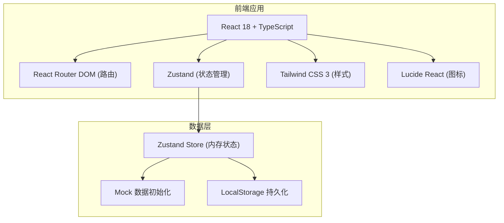
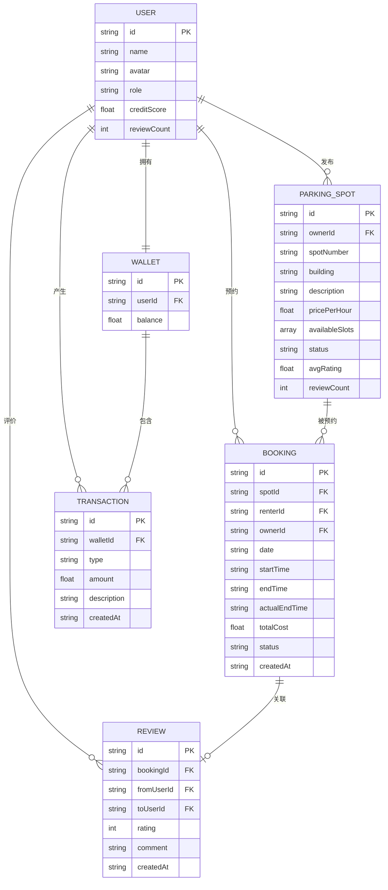

## 1. 架构设计



## 2. 技术描述
- **前端框架**：React@18 + TypeScript
- **构建工具**：Vite@5
- **路由管理**：react-router-dom@6
- **状态管理**：zustand@4
- **UI样式**：tailwindcss@3 + postcss + autoprefixer
- **图标库**：lucide-react
- **后端**：无（纯前端Mock数据 + LocalStorage持久化）
- **数据库**：LocalStorage 浏览器存储
- **初始化工具**：vite-init

## 3. 路由定义
| 路由 | 页面 | 用途 |
|-------|---------|---------|
| / | HomePage | 首页 - 车位列表浏览与筛选 |
| /publish | PublishPage | 业主发布车位页面 |
| /orders | OrdersPage | 订单管理页面 |
| /wallet | WalletPage | 我的钱包页面 |
| /reviews | ReviewsPage | 信用评价页面 |
| /my-spots | MySpotsPage | 业主车位管理页面 |

## 4. 数据模型

### 4.1 数据模型定义



### 4.2 类型定义（TypeScript）

```typescript
type UserRole = 'owner' | 'renter';

interface User {
  id: string;
  name: string;
  avatar: string;
  role: UserRole;
  creditScore: number;
  reviewCount: number;
}

interface TimeSlot {
  startTime: string;
  endTime: string;
}

interface AvailableDate {
  date: string;
  slots: TimeSlot[];
}

interface ParkingSpot {
  id: string;
  ownerId: string;
  spotNumber: string;
  building: string;
  description: string;
  pricePerHour: number;
  availableDates: AvailableDate[];
  status: 'active' | 'inactive';
  avgRating: number;
  reviewCount: number;
}

type BookingStatus = 'pending' | 'active' | 'completed' | 'cancelled';

interface Booking {
  id: string;
  spotId: string;
  renterId: string;
  ownerId: string;
  date: string;
  startTime: string;
  endTime: string;
  actualEndTime?: string;
  totalCost: number;
  status: BookingStatus;
  createdAt: string;
}

interface Wallet {
  id: string;
  userId: string;
  balance: number;
}

type TransactionType = 'deposit' | 'payment' | 'income';

interface Transaction {
  id: string;
  walletId: string;
  type: TransactionType;
  amount: number;
  description: string;
  createdAt: string;
}

interface Review {
  id: string;
  bookingId: string;
  fromUserId: string;
  toUserId: string;
  rating: number;
  comment: string;
  createdAt: string;
}
```

## 5. 项目目录结构

```
src/
├── components/           # 可复用组件
│   ├── Layout/          # 布局组件
│   ├── ParkingSpot/     # 车位相关组件
│   ├── Booking/         # 订单相关组件
│   ├── Wallet/          # 钱包相关组件
│   ├── Review/          # 评价相关组件
│   └── UI/              # 通用UI组件
├── pages/               # 页面组件
│   ├── HomePage.tsx
│   ├── PublishPage.tsx
│   ├── OrdersPage.tsx
│   ├── WalletPage.tsx
│   ├── ReviewsPage.tsx
│   └── MySpotsPage.tsx
├── store/               # Zustand状态管理
│   ├── useUserStore.ts
│   ├── useParkingStore.ts
│   ├── useBookingStore.ts
│   ├── useWalletStore.ts
│   └── useReviewStore.ts
├── types/               # TypeScript类型定义
│   └── index.ts
├── utils/               # 工具函数
│   ├── dateTime.ts
│   ├── calculations.ts
│   └── mockData.ts
├── App.tsx
├── main.tsx
└── index.css
```

